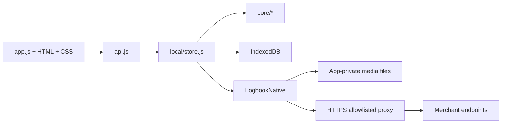

# Architecture

## Summary

Dazzle Diary is a local-first Android application with two implementation layers:

1. a plain JavaScript web client; and
2. a small native Android WebView host.

There is no application server in the standalone APK.



## Design goals

The architecture favours:

- local ownership of personal data
- no account system
- no Dazzle Diary backend
- small APK and low dependency count
- business rules that can be tested outside Android
- durable project records independent of merchant availability
- explicit network boundaries
- responsive behaviour across phone, foldable and tablet widths

## Client structure

```text
app/
  core/
    csv.js
    estimate.js
    import.js
    match.js
    shops.js
    status.js
  local/
    idb.js
    store.js
  fonts/
  api.js
  app.js
  index.html
  styles.css
```

There is no framework runtime or JavaScript bundle step.

### `app.js`

`app.js` owns:

- hash routing
- screen rendering
- view state
- project interactions
- catalogue browse UI
- import review UI
- Summary and records
- Settings
- form dirty-state protection
- scroll-position memory
- two-pane routing behaviour

### `api.js`

The UI talks to an HTTP-shaped API abstraction.

In the standalone Android build, calls are routed to `local/store.js`.

Conceptually:

```text
app.js
  |
  | api('/projects/12', { method: 'PATCH', ... })
  v
api.js
  |
  v
local/store.js
```

This keeps storage implementation details out of the UI and lets tests exercise the same route-shaped interface.

## Routes

Important client routes include:

```text
#/                    My Logbook
#/p/:id               project page
#/p/:id/edit          project Details
#/new                  new project
#/browse               catalogue browser
#/import               order import
#/summary              Summary and records
#/settings             Settings
#/licences             bundled font licences
```

## Navigation and scroll state

Dazzle uses explicit helpers for:

- going deeper
- going back
- replacing the current route after completing a form

This prevents duplicate project/form screens building up in history.

Scroll position is stored by route so:

- returning from a project restores the previous logbook position;
- returning to a project restores the position within that project;
- two-pane mode remembers the logbook and right-hand pane independently.

When filters change, the relevant stored scroll position is cleared because the old position no longer maps cleanly to the new result set.

## Form protection

New project and Details forms snapshot all values relevant to Save.

If navigation tries to leave a dirty form:

1. Dazzle asks whether to discard changes.
2. If the user chooses to continue editing, the current form values are captured.
3. The route is restored.
4. The captured values are reapplied.

This protects against the top Back action, Cancel and Android Back.

## Core domain logic

`app/core/` is intended for logic with no DOM/Android/IndexedDB dependency.

### `status.js`

Owns lifecycle rules such as:

- status transitions
- status derived from dates
- hold periods
- held-day calculations

Every UI route should use the same functions rather than reimplementing status semantics.

### `csv.js`, `match.js`, `import.js`

Together they handle:

- CSV parsing
- Diamond Art Club export quirks
- title normalisation
- candidate matching
- ambiguity
- import preview/reconciliation
- price provenance

### `estimate.js`

Provides area/shape-based drill-count estimation.

### `shops.js`

Defines:

- shop identities
- platform
- currency
- product classification
- feed parsing
- optional per-product specification parsing
- link construction
- supported project currencies

## IndexedDB

The database is:

```text
name: logbook
version: 2
```

Version 2 added the `sessions` store.

Stores:

```text
projects
photos
sessions
catalogue
blobs
meta
```

### Projects

A project is the durable user record.

It carries fields such as:

- title/artist
- status
- dimensions/specification
- price/currency
- progress
- dates
- notes
- catalogue handle/shop
- cover/gallery names
- holds
- rating
- derived total hours

### Sessions

Sessions are stored separately with a `project_id` index.

Project `hours` is maintained as a derived aggregate so statistics/export can read one number without replaying sessions every time.

Old pre-session `hours` values are migrated into a session once.

### Photos

Photo metadata is stored in IndexedDB and indexed by `project_id`.

The actual image bytes live in private files.

### Catalogue

Catalogue rows use a compound key:

```text
[shop, handle]
```

with an index by `shop`.

The catalogue is persisted in IndexedDB but also held in memory while the app is running for simple matching/search.

### Meta

`meta` stores items such as:

- catalogue sync timestamps
- preferences
- one-time hint state
- migration markers

## Media storage

Cover and progress-photo bytes are stored below the app's private files directory.

Conceptually:

```text
media/
  covers/
  photos/
```

The WebView sees them through private-origin routes:

```text
/covers/<file>
/photos/<file>
```

Paths are canonicalised in the native host before file access.

## Unified project gallery

The project route creates one in-memory gallery containing:

1. listing/shop images
2. progress photos

The full-screen viewer uses CSS scroll snapping for swiping and adds:

- image count
- pinch zoom
- double-tap zoom
- pan while zoomed
- Set as cover for personal photos
- Share for personal photos where the Android bridge is available

## Private application origin

The page is served from:

```text
https://appassets.androidplatform.net/
```

rather than a `file://` URL.

This gives the page:

- a secure-context-style origin
- normal relative URLs
- IndexedDB/service-worker compatibility
- a clear origin against which the JavaScript bridge can be trusted

The Android host intercepts requests for:

- bundled assets
- private media
- the native network proxy

## Native Android shell

`MainActivity` is intentionally narrow.

The WebView:

- enables JavaScript and DOM storage
- enables database storage
- disables normal file access
- disables content access
- disables WebView zoom controls
- sends external top-level navigation to the system browser
- tracks whether the loaded top-level page is the trusted app origin

The activity handles configuration changes including orientation/screen-size/smallest-screen-size/screen-layout/UI mode, which matters on foldables.

## JavaScript bridge

The bridge is exposed as:

```text
LogbookNative
```

Purpose-specific methods include capabilities such as:

- write app-private media
- save a backup/CSV into Downloads
- share a progress photo
- query system dark mode
- set system bar colour

Bridge methods verify that the WebView is still on the trusted packaged origin.

### Sharing a photo

A WebView does not have the required native share path here.

`sharePhoto`:

1. reads the selected private progress photo;
2. writes a copy into Android `MediaStore.Images`;
3. launches an `ACTION_SEND` chooser with a content URI.

This is an explicit transition from app-private storage into shared Android media.

## Native HTTPS proxy

Merchant sites generally do not send CORS headers permitting the packaged page to fetch them directly.

The client therefore requests:

```text
/__net/?url=<encoded HTTPS URL>
```

and the native host performs the GET.

Security properties:

- HTTPS only
- allowlisted hostnames only
- exact host/subdomain matching
- redirects followed manually
- every redirect target rechecked
- at most five redirects
- connect/read timeouts
- response returned to the private app origin

### Allowlist

The inspected APK contains:

```text
diamondartclub.com
mysticaldreamdiamonds.com
pressedandplaced.com
diamondartuk.co.uk
fallongems.com
diamondartstudio.co.uk
cdn.shopify.com
myshopify.com
wp.com
```

Every shop in `app/core/shops.js` must also appear in that allowlist. A shop in one and not the other cannot reach the network at all, and reports only `HTTP 500` while failing — which is what happened when Munimade was added. A test in `test/core.test.mjs` now holds the two lists in step.

This is a useful example of an architectural invariant:

> A shop is not fully added until both `shops.js` and the native allowlist agree.

## Catalogue sync

A sync:

1. selects enabled shops, or one explicitly requested shop;
2. fetches their structured product feeds;
3. normalises them;
4. replaces the cached rows for each shop;
5. records per-shop sync metadata;
6. backfills missing project covers where possible;
7. backfills supported specification fields for owned projects where the feed lacks them.

Partial shop failure does not necessarily make the entire job fail if other shops completed successfully.

## Lazy per-project specification

For a shop whose feed omits fields but whose product page publishes them, `shops.js` can define a `spec()` parser.

`store.js` then fetches the product page:

- only for a linked project that still has missing supported fields;
- only when that shop has a spec parser;
- once if a page was successfully checked;
- without overwriting values already present on the project.

This avoids crawling every product page during catalogue sync.

## Status/date invariants

The app deliberately has multiple interaction paths:

- drag card between logbook sections
- status menu on project
- date correction on project
- Details form
- progress reaching 100%

They should all preserve the same lifecycle semantics.

Domain rules belong in `status.js`/the local API, not in one UI route only.

## Responsive architecture

There are three related behaviours.

### Card grids

Grid columns use `auto-fill` so the card count follows available width rather than a hard-coded device class.

### Wide reading surfaces

At 620px and above, the app can use the full shell while reading/typing content retains a comfortable maximum measure.

### Two-pane mode

At:

```text
min-width: 900px
```

the shell creates:

```text
<aside id="side">  logbook
<main id="main">   selected route
```

The logbook remains visible while project, browse, summary or settings content opens beside it.

### Very wide forms

At 1000px and above, only:

```text
.screen.reading.form
```

flows form groups into multiple columns.

Settings deliberately remains a sequential reading layout.

## Backup and restore

A full backup serialises:

```text
version
exportedAt
projects[]
photos[]
sessions[]
```

Hold history is already part of each project.

Progress-photo bytes are base64-encoded into the backup.

Catalogue covers are deliberately excluded as portable media and are refetched after restore.

Restore:

- validates that a projects array exists;
- matches existing records by lowercased title + order reference;
- adds missing projects;
- merges metadata into matches;
- protects local progress, hours, notes and sold price;
- ignores backed-up cover filenames;
- remaps sessions/photos to local project IDs;
- deduplicates sessions and photos;
- recalculates hours;
- attempts to backfill covers.

## Build architecture

`android/build.sh` performs seven stages:

1. copy/bundle the web app and stamp `version.json`
2. compile Android resources with `aapt2`
3. link resources/manifest/assets
4. compile Java
5. run `d8`
6. package and align
7. sign

There is no Gradle project.

## Architectural invariants

Changes should preserve these unless intentionally redesigning the system:

1. **Projects outlive catalogue rows.**
2. **Personal logbook data does not require a Dazzle Diary backend.**
3. **Core matching/status logic remains testable without Android or a browser.**
4. **The native bridge stays purpose-specific.**
5. **External network requests are HTTPS and host allowlisted.**
6. **Every redirect is revalidated.**
7. **Shop adapters and the native allowlist are kept in step.**
8. **A user-entered value is not silently overwritten by catalogue refresh.**
9. **Estimated values remain visibly estimates.**
10. **Backups retain irreplaceable personal content such as progress photos and sessions.**
11. **Responsive decisions follow available layout space rather than named device models.**
