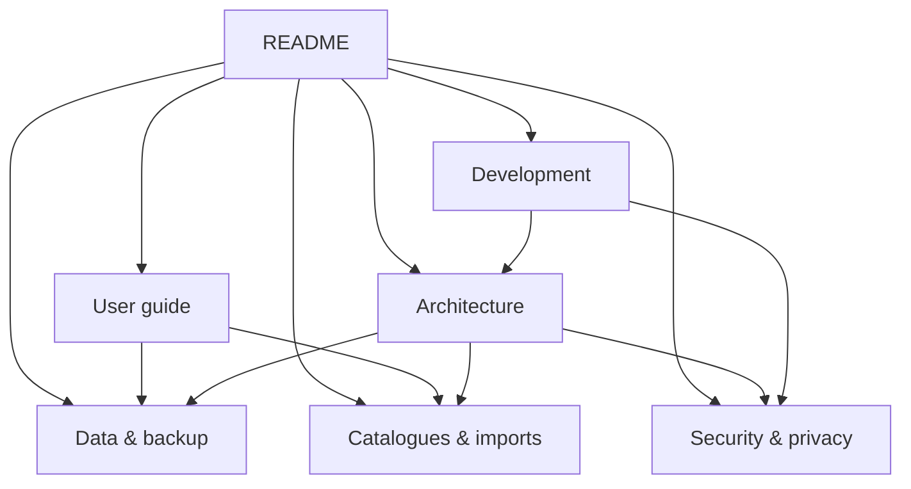

# Dazzle Diary documentation

These docs describe the current application model and repository layout.

## For users

### [User guide](USER_GUIDE.md)

Start here for:

- first-time catalogue setup
- finding and filtering projects
- project statuses
- progress, sessions, holds, ratings and notes
- photo gallery and sharing
- adding from catalogues
- order import
- Summary and records
- backup and restore
- foldable/tablet behaviour
- troubleshooting

### [Data and backup](DATA_AND_BACKUP.md)

Use this when you need to know:

- what is stored locally
- what is in IndexedDB versus app-private files
- what a full backup contains
- how merge restore behaves
- what happens to covers
- what sharing a photo does
- what to do before uninstalling/resetting a phone

## For developers

### [Architecture](ARCHITECTURE.md)

The web client, HTTP-shaped local API, IndexedDB, native Android shell, media files, network proxy, responsive/two-pane UI and architectural invariants.

### [Catalogues and order imports](CATALOGUES_AND_IMPORTS.md)

Shop adapters, provider differences, normalised rows, lazy specification enrichment, browsing, matching, pricing, currencies and adding another shop.

### [Development](DEVELOPMENT.md)

Build requirements, direct Android build, signing, tests, DOM harness, layout probe, preview server, CI and release workflow.

### [Security and privacy](SECURITY_AND_PRIVACY.md)

Permissions, private application origin, WebView restrictions, JavaScript bridge, HTTPS proxy allowlist, backups, photo sharing and security controls.

### [Contributing](../CONTRIBUTING.md)

Project conventions and review expectations.

### [Security policy](../SECURITY.md)

How to report a security problem without exposing personal logbook data.

## Documentation map

